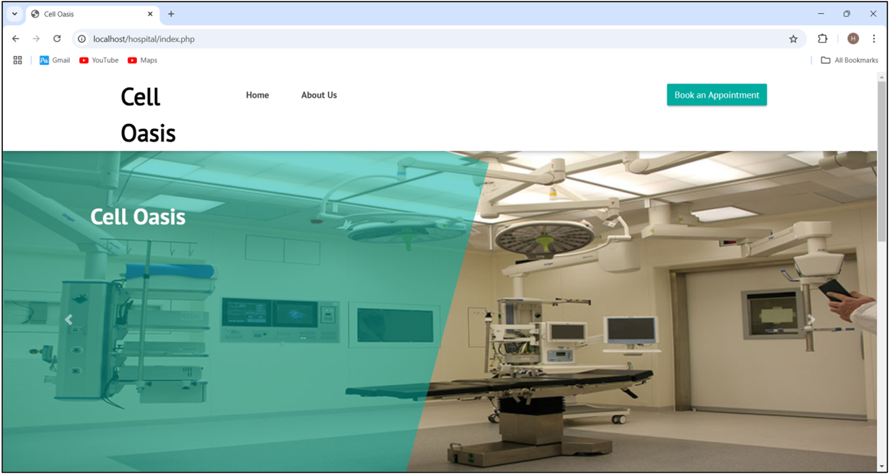
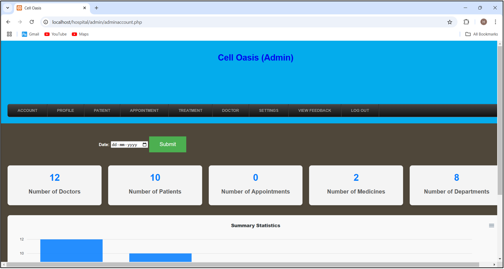
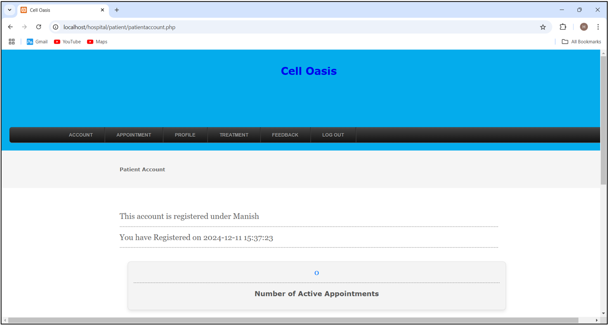
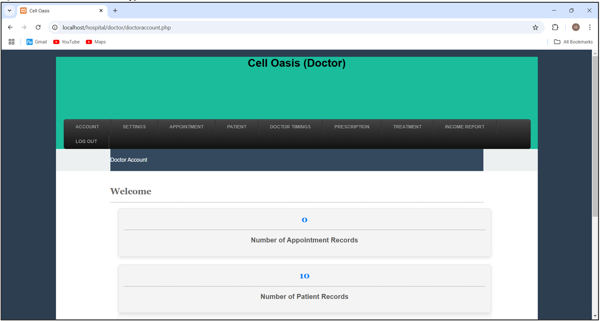

# Cell Oasis - Hospital Management System

 A comprehensive Hospital Management System built with PHP and MySQL. This system allows efficient management of hospital operations, including patient records, appointments, billing, and more, developed as part of my M.Sc. in Computer Science project at the University of East London (December 2024).


## 🎯 About the Project

Cell Oasis is a full-featured Hospital Management System that provides separate portals for three user roles:

- **Patients** can book appointments, view prescriptions, and manage their profiles
- **Doctors** can manage appointments, create prescriptions, and maintain treatment records
- **Administrators** have full control over the entire system

This project was developed as a part of M.Sc. Computer Science curriculum in December 2024.


## 📋 Table of Contents

- [About the Project](#about-the-project)
- [Features](#features)
- [Tech Stack](#tech-stack)
- [Installation](#installation)
- [Usage](#usage)
- [Project Structure](#project-structure)
- [Database](#database)
- [Screenshots](#screenshots)
- [Future Enhancements](#future-enhancements)
- [License](#license)
- [Contributors](#contributors)
- [Acknowledgments](#acknowledgments)


## ✨ Features

### 👤 Patient Portal
- User registration and login
- Online appointment booking
- View appointment status (Pending/Approved/Rejected)
- Prescription history
- Profile management
- Password recovery

### 👨‍⚕️ Doctor Portal
- Self-registration for doctors
- Login authentication
- View and manage appointments
- Approve/reject patient appointments
- Create prescriptions
- Treatment records management
- Profile and availability management

### ⚙️ Admin Panel
- Dashboard with statistics
- Department management
- Doctor management
- Patient management
- Appointment management
- Medicine inventory
- Treatment records
- View patient feedback
- Reports generation

### 🌐 Public Features
- Home page with hospital information
- About Us page
- Contact Us form
- Department information
- Doctor profiles


## 🛠 Tech Stack

| Category | Technology |
|----------|------------|
| **Frontend** | HTML5, CSS3, JavaScript, Bootstrap 4 |
| **Backend** | PHP 8.x |
| **Database** | MySQL (phpMyAdmin) |
| **Server** | Apache (XAMPP/WAMP) |
| **Email** | PHPMailer |


## 📦 Installation

### Prerequisites
- XAMPP (or WAMP/LAMP) installed
- Web browser (Chrome, Firefox, Edge)
- Code editor (VS Code, Sublime Text)

### Steps

1. **Clone the Repository**
   ```bash
   git clone https://github.com/yourusername/cell-oasis-hospital.git
   ```

2. **Setup Database**
   - Open phpMyAdmin (`http://localhost/phpmyadmin`)
   - Create a new database named `hospital`
   - Import the SQL file from `db/` folder

3. **Configure Project**
   - Copy project to `htdocs/hospital` (XAMPP) or `www/hospital` (WAMP)
   - Update database credentials in `dbconnection.php` if needed

4. **Run the Application**
   - Start Apache and MySQL in XAMPP
   - Open browser and navigate to `http://localhost/hospital/`


## 🚀 Usage

### Default Login Credentials

| Role | URL | Username | Password |
|------|-----|----------|----------|
| **Admin** | `/admin/adminlogin.php` | admin | admin123 |
| **Doctor** | `/doctor/doctorlogin.php` | (Register new) | (Register new) |
| **Patient** | `/patient/patientlogin.php` | (Register new) | (Register new) |


## 📂 Project Structure

```
hospital/
├── admin/                       # Admin panel
│   ├── adminlogin.php           # Admin login
│   ├── adminaccount.php         # Admin account management
│   ├── adminprofile.php         # Admin profile
│   ├── adminchangepassword.php  # Change password
│   ├── appointment.php          # Appointment management
│   ├── appointmentapproval.php  # Approve appointments
│   ├── department.php           # Department management
│   ├── doctor.php               # Doctor management
│   ├── medicine.php             # Medicine inventory
│   ├── treatment.php            # Treatment records
│   ├── patient.php              # Patient management
│   ├── addpatient.php           # Add new patient
│   ├── doctortimings.php        # Doctor timings
│   ├── view*.php                # View pages (patients, doctors, appointments, etc.)
│   ├── menu.php                 # Menu navigation
│   ├── headers.php              # Header files
│   ├── footers.php              # Footer files
│   └── dbconnection.php         # Database connection
│
├── doctor/                      # Doctor panel
│   ├── doctorlogin.php          # Doctor login
│   ├── doc_reg.php              # Doctor registration
│   ├── doctoraccount.php        # Doctor account
│   ├── doctorprofile.php        # Doctor profile
│   ├── doctorchangepassword.php # Change password
│   ├── appointmentapproval.php  # Approve/reject appointments
│   ├── prescription.php         # Create prescriptions
│   ├── prescriptionorder.php   # Prescription orders
│   ├── treatmentdetail.php      # Treatment details
│   ├── doctortimings.php        # Doctor timings
│   ├── viewappointment.php      # View appointments
│   ├── viewpatient.php          # View patients
│   ├── viewtreatment.php        # View treatments
│   ├── viewbilling.php          # View billing
│   ├── menu.php                 # Menu navigation
│   ├── header.php               # Header file
│   ├── footer.php               # Footer file
│   └── dbconnection.php         # Database connection
│
├── patient/                     # Patient panel
│   ├── patientlogin.php         # Patient login
│   ├── patientforgotpassword.php # Password recovery
│   ├── patientaccount.php       # Patient account
│   ├── patientprofile.php       # Patient profile
│   ├── patientchangepassword.php # Change password
│   ├── patientappointment.php  # Book appointments
│   ├── prescription.php        # View prescriptions
│   ├── prescriptionorder.php    # Prescription orders
│   ├── treatment.php            # Treatment records
│   ├── feedback.php             # Submit feedback
│   ├── viewappointment.php      # View appointments
│   ├── viewtreatmentrecord.php # View treatment records
│   ├── viewbilling.php          # View billing
│   ├── departmentDoctor.php     # View doctors by department
│   ├── menu.php                 # Menu navigation
│   ├── header.php               # Header file
│   ├── footer.php               # Footer file
│   └── dbconnection.php         # Database connection
│
├── assets/                      # CSS, images, JS
├── layout/                      # Layout styles
├── db/                          # Database files
├── docs/                        # Documentation
├── js/                          # JavaScript files
├── phpmail/                     # Email functionality
├── Screenshot/                  # Project screenshots
├── index.php                    # Home page
├── aboutus.php                  # About Us page
├── contactus.php                # Contact Us page
├── departmentDoctor.php         # Department-Doctor page
├── header.php                   # Main header
├── patient.php                  # Patient landing
├── patientlogin.php             # Patient login redirect
├── patientappointment.php       # Patient appointment redirect
├── dbconnection.php             # Database connection
└── LICENSE                      # MIT License
```


## 🗃 Database

### Key Tables
- `admin` - Administrator accounts
- `doctor` - Doctor profiles
- `patient` - Patient records
- `appointment` - Appointment bookings
- `prescription` - Doctor prescriptions
- `department` - Hospital departments
- `medicine` - Medicine inventory
- `treatment` - Treatment records


## 📸 Screenshots

| Home Page | Admin Panel | Patient Portal | Doctor Portal |
|-----------|-------------|---------------|---------------|
|  |  |  |  |


## 🔮 Future Enhancements

- [ ] SMS notification integration
- [ ] Email notifications for appointments
- [ ] Online payment gateway
- [ ] Video consultation feature
- [ ] Mobile application (Android/iOS)
- [ ] Lab report management
- [ ] Inventory management system
- [ ] Advanced billing system
- [ ] AI-based symptom checker


## 📄 License

This project is licensed under the MIT License - see the [LICENSE](LICENSE) file for details.


## 👥 Contributors

| Detail |
|--------|
| Group Project - M.Sc. Computer Science, University of East London |


## 🙏 Acknowledgments

- University of East London - Faculty and Project Guide
- Open source community for PHP, Bootstrap, and other libraries

---

**Note:** This is an academic project built during my **M.Sc. in Computer Science** at the **University of East London**, completed in **December 2024.**

